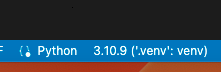

# flask-web-app

My first ground-up attempt at creating and deploying a Flask web app to Azure using VSCode tools. 

## Proper Python

I started this effort by following my own guidance from [Proper Python](https://blog.summittdweller.com/posts/2022/09/proper-python) environment to create an activate a proper `.venv` Python virtual environment.  Note that `.venv` will NOT be part of this project's GitHub repo because it is explicitly excluded in the project's `.gitignore` file.  

Because the `.venv` is not part of this project repo it may be necessary to repeat several of the [Proper Python](https://blog.summittdweller.com/posts/2022/09/proper-python) each time you work locally with this project.  

## Deploying Flask web app on Microsoft Azure

Next, I followed the guidance found in [Deploying Flask web app on Microsoft Azure](https://medium.datadriveninvestor.com/deploying-flask-web-app-on-microsoft-azure-89cea17e9114) to the letter.  That appears to have worked very well, with one word of caution...  

### Check Your Python Interpreter Settings in VSCode

  

With `app.py` loaded in VSCode be sure to check the lower-right corner of the workspace to verify that VSCode is using the `.venv` copy of Python!  

## The Outcome

The simple app was successfully configured and deployed to "deploying-flask-web-app": https://deploying-flask-web-app.azurewebsites.net.  
